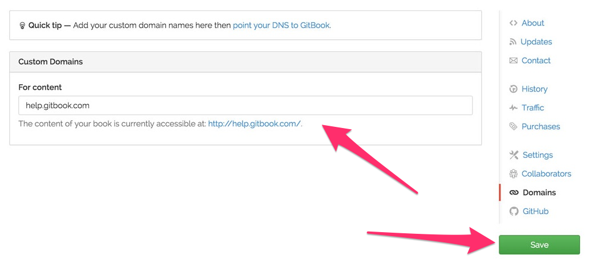

# 自定义域名

所有在 **Gitbook.com** 上的书的http地址为 `http://{author}.gitbooks.io/{book}/`，而书内容的地址是 `http://{author}.gitbooks.io/{book}/content/`。

但是你也可以使用你自定义的域名（GitBook的免费功能）。域名可以绑定到你的主页或者内容上（或两者都）。

很容易就可以添加一个自定义域名。

## GitBool.com 设置

前往你书本的 **设置** 页面，点击 **域名**。然后输入你的域名并保存。



## 域名提供商设置

为了完成域名绑定，你需在你的域名提供商那边做一些设置：

1. 登陆你的域名注册商的网站，找到允许你 添加/编辑 主机记录的页面，通常这个页面会在 `编辑 DNS`，`主机记录` 或者 `域文件控制` 的设置里。

2. 设置一个值为 `www` 的 **CNAME** 记录，URL域指向： ```www.gitbooks.io```。

3. 为了 **重定向** 顶级域名（`yourdomain.com`）到 `www.yourdomain.com` 上，你需要开启 *“域名转发”*。这个功能通常在 `转发`，`URL 转发` 或者 `URL 重定向` 中（大陆域名提供商已于2009年12月29日起禁用域名转发功能）。

DNS 解析的转播可能需要花上几个小时的时间。
