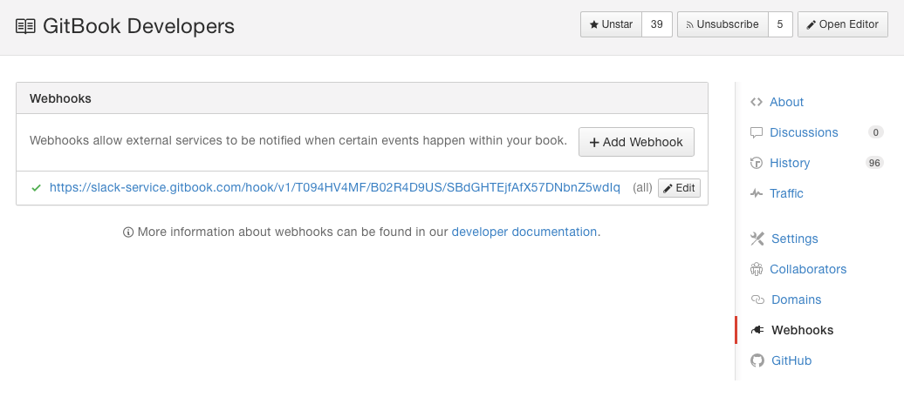

# Webhooks

Webhooks 提供了一种任何时候只要有操作作用于书上就通知外部服务器的方式。

很多作用于书本的操作都会触发 Webhooks。

为了建立一个新的 webhook，你需要访问外部服务器，并且熟悉技术规格。如果需要帮助，请访问 [开发者指南](http://developer.gitbook.com/webhooks/index.html)，它包含了你可以关联的所有的操作。

## 配置 webhook

你可以在书本的设置里配置 webhook：

